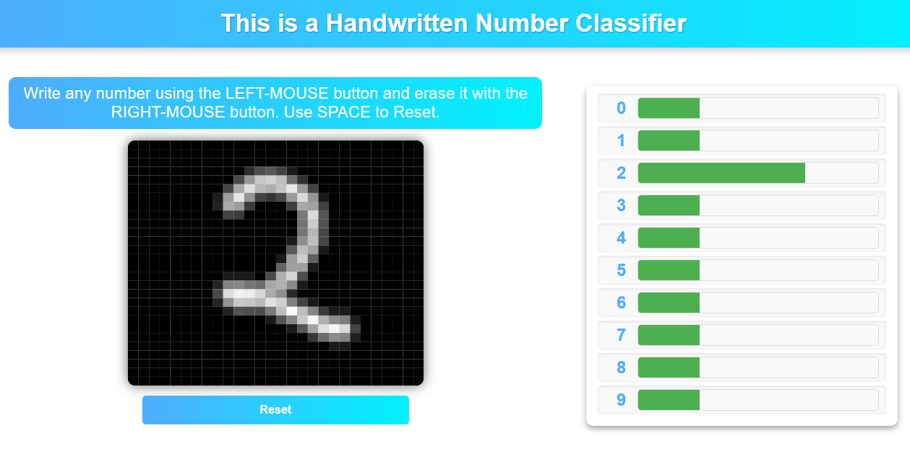

# Digit Recognition System

## Overview

This project is a Convolutional Neural Network (CNN) based digit recognition system. It is trained on the MNIST dataset, which consists of handwritten digits. The system can accurately recognize and classify digits from 0 to 9.

## Features

- Utilizes Convolutional Neural Networks (CNNs) for high accuracy
- Trained on the MNIST dataset
- Capable of recognizing handwritten digits
- Easy to use and integrate into other projects

## Dataset

The model is trained on the MNIST dataset, which is a large database of handwritten digits commonly used for training various image processing systems.

## Contributing

Contributions are welcome! Please fork the repository and submit a pull request.

## Acknowledgements

- The MNIST database of handwritten digits
- TensorFlow and Keras libraries
